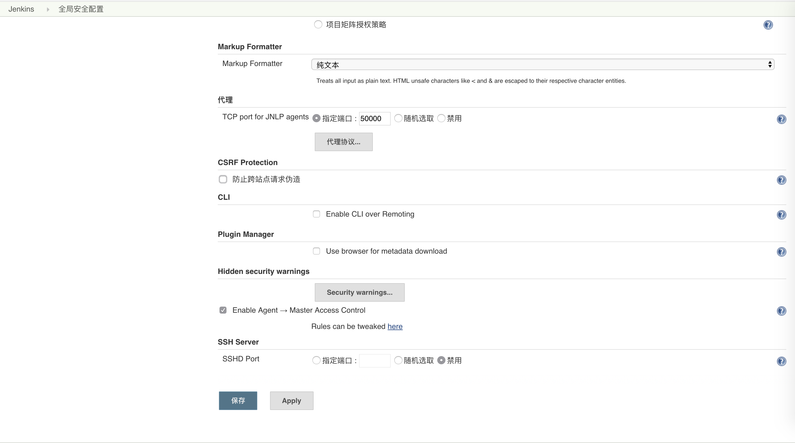

# Docker + jenkins + webhooks 自动部署基础实践

- 熟悉 jenkins 的基本操作
- 实现本地 git push 后 jenkins 自动构建部署服务

此实践用于优化自己在实际工作中的工作流程

1. 在本地开发 project
1. git push project 到 git 服务器
1. 登录云服务器， git pull project 
1. pm2 restart project 或者 node app.js

简化流程后

1. 本地开发 peoject 
1. git push
1. 云服务器自动构建部署


本实践将结合 docker 技术即实现云服务器处只需安装 docker 就可实现各种环境的切换与部署。

### docker 及 jenkins 安装 

我的是 centos7.4， ssh 连接服务器命令行安装

 **yum install docker -y**

 **service docker start**

Jenkins 是一个用 Java 写的开源的持续集成软件

为了避免安装各种各样的 Java 依赖， 我们直接安装 Jenkins 镜像， 并映射在云服务器的 8080 端口

我们依据 Jenkins [官方的教程](https://jenkins.io/doc/tutorials/build-a-node-js-and-react-app-with-npm/) 来安装。 我安装的是集成 blue ocean 版的镜像

**docker run \
  --rm \
  -u root \
  -d \
  -p 8080:8080 \
  -v jenkins-data:/var/jenkins_home \ 
  -v /var/run/docker.sock:/var/run/docker.sock \
  -v "$HOME":/home \ 
  jenkinsci/blueocean**


后台运行并映射到服务器 8080 端口， 挂在服务器的 jenkins-data 文件夹到 jenkins 容器内， /var/run/docker.sock 用来监听 docker 的连接

稍等片刻， 在浏览器上打开 8080 端口， 配置 jenkins


需要我们在 docker 内以命令行模式进入 jenkins 获取密码

**docker exec -it amazing_morse sh**

> amazing_morse 是默认的容器名

**cd ／var/jenkins_home/secrets/initialAdminPassword**


查看密码， 填写到页面上

设置 Jenkins 安全策略 「这样才能远程执行 webhooks」取消防止跨站点请求伪造并保存



继续在 Jenkins 容器内生成 ssh 秘钥「用于 jenkins 拉取 git 项目的授权」

**cat ~/.ssh/id_rsa.pub**

**ssh-keygen -t rsa -C "youremail"**

**cat ~/.ssh/id_rsa.pub**

复制秘钥， 粘贴到 git 服务器内的 sshKeys 内， 这样 jenkins 就能在你每次 git push 后自动拉取你的 project 了。


### Jenkins  部署 project

首先在你的 project 内新建 Dockerfile 文件, 内容如下： 

````dockerfile
# 拉取一个基本 node 运行环境的镜像，作为基础镜像
FROM node:7-alpine


RUN mkdir -p /app
COPY . /app

WORKDIR /app
RUN npm install

EXPOSE 3000

# 开启 node 服务器

CMD ["node", "app.js"]
````

我们利用 node:7-alpine 镜像重新生成一个自己的镜像

app.js 是我的启动文件，内容如下：

````js
const http = require('http')

http.createServer((req, res) => {
    res.end('jenkins t2')
}).listen(3000, () => {
    console.log('running on port 3000');
})
````

