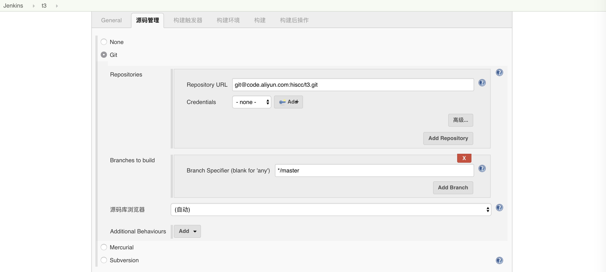

# Docker + Jenkins + webhooks 自动部署基础实践

- 熟悉 jenkins 的基本操作 ☑️
- 实现本地 git push 后 jenkins 自动构建部署服务 ☑️

此实践用于优化自己在实际工作中的工作流:

1. 在本地开发 project
1. git push project 到 git 服务器
1. 登录云服务器， git pull project
1. pm2 restart project 或者 node app.js

简化流程后：

1. 本地开发 project
1. git push
1. 云服务器自动构建部署


本实践将结合 docker 技术实现对各种环境的切换与部署。

基本原理：
> webhook 即为一个 url。 配合 jenkins， 你的 git 服务器会在有新提交的时候请求这个 url， 而这个 url 背后对应着 jenkins 内的构建任务， 如此便实现了自动化构建。

> 在本例中使用 docker 主要是为了确立运行环境的独立性， 这里主要是为了便于安装 jenkins 。 当然你也可以直接 **yum install jenkins** 把他安装在云服务器上。

> 没有使用 Jenkinsfile 或 blue ocean 来部署的原因是对开启 webhook 不太友好「或许说是流程没有这样简单顺畅」。

### docker 及 jenkins 安装

我的服务器是 centos7.4， ssh 连接服务器后用命令行安装 docker

 **yum install docker -y**

 **service docker start**

Jenkins 是一个用 Java 写的开源的持续集成软件。

为了避免安装各种各样的 Java 依赖， 我们直接安装 Jenkins 镜像， 并映射在云服务器的 8080 端口

我们依据 [Jenkins 官方的教程](https://jenkins.io/doc/tutorials/build-a-node-js-and-react-app-with-npm/) 来安装。 我安装的是集成 blue ocean 版的镜像

````
  docker run \
  --rm \
  -u root \
  -d \
  -p 8080:8080 \
  -v jenkins-data:/var/jenkins_home \
  -v /var/run/docker.sock:/var/run/docker.sock \
  -v "$HOME":/home \
  -v /root:/root \
  jenkinsci/blueocean
  ````


后台运行并映射到服务器 8080 端口， 挂载服务器的 jenkins-data 文件夹到 jenkins 容器内， /var/run/docker.sock 用来监听 docker 的连接

>相比 Jenkins 原教程， 我在这里额外添加了 **-d** 、 **-v ／root：／root** 命令， **-d** 命令用于后台启动 Jenkins， **-v ／root：／root** 用于挂载服务器的 root 文件夹到主机的 root 文件夹下


同时在我们的服务器内生成 ssh 秘钥「用于 jenkins 拉取 git 项目的授权」

**cat ~/.ssh/id_rsa.pub**

**ssh-keygen -t rsa -C "youremail"**

**cat ~/.ssh/id_rsa.pub**

复制秘钥， 粘贴到 git 服务器内的 sshKeys 内， 这样 jenkins 就能在你每次 git push 后自动拉取你的 project 了。


稍等片刻， 在浏览器打开 8080 端口， 配置 jenkins


需要我们在 docker 内以命令行模式进入 jenkins 容器内获取密码

**docker ps**

找到出 jenkins／blueocean 容器的**id**

**docker exec -it id sh**

> id  是你 docker ps 后 jenkins／blueocean 容器的 id

**cd ／var/jenkins_home/secrets/initialAdminPassword**


查看密码， 填写到页面上

设置 Jenkins 安全策略，取消防止跨站点请求伪造并保存「这样才能远程执行 webhooks」


在 jenkins／插件管理内安装两个插件

**generic webhook trigger** 和 **post build task**


### Jenkins  部署 project

首先在你的 project 内新建 Dockerfile 文件, 内容如下：

````dockerfile
# 拉取一个基本 node 运行环境的镜像，作为基础镜像
FROM node:7-alpine


RUN mkdir -p /app
COPY . /app

WORKDIR /app
RUN npm install

EXPOSE 3000

# 开启 node 服务器

CMD ["node", "app.js"]
````

我们利用 node:7-alpine 镜像重新生成一个自己的镜像

app.js 是我的启动文件，内容如下：

````js
const http = require('http')

http.createServer((req, res) => {
    res.end('jenkins t2')
}).listen(3000, () => {
    console.log('running on port 3000');
})
````

ok， 设置好 project 的基本服务后， 浏览器打开 jenkins 新建一个项目


开始设置 project 信息， 如果你没有把前面生成的 sshkey 添加到你的 git 服务器中， 这个 project 将无法设置



然后设置 webhooks 的 token ， 并勾选下方的 generic webhook trigger。

然后依据 generic webhook trigger 给出的提示把 **你的服务器地址：8080/job/t1/build?token=你的token** 这个hook 添加到你的 git 服务器上的 webhook 设置内。


设置构建任务， 这里我用 docker 构建一个叫 frontend  的镜像， 在构建好镜像后运行一个叫 express 的容器 「这里先要杀掉前一个叫 express 的容器，才能运行新的容器，因为如果每次构建时前一个容器还在运行即端口一直被占用着会导致运行失败」。
构建 docker 容器时记得加参数 **-d** 不然构建任务会阻塞 jenkins 任务队列。


保存修改，在本地修改代码，并推送到 git 服务器，发现 Jenkins 开启了自动构建。


### 其它

我的 git 服务器是 alicode 「一个 gitlab 服务， 可以放置私有 project， 当然你也可以自己搭建一个 gitlab」。

如果你使用其它 git 服务流程也大同小异， 例如 github 、 bitbucket 等等。



